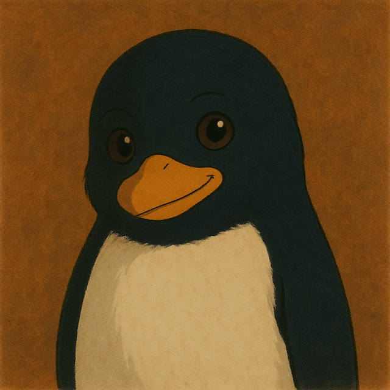

# 🐧 Pengulino

> *"Just a penguin, standing in front of GitHub, asking for some stars."*  
> – Pengulino

---



### Hi there, I’m **Pengulino**! 🧊✨

I’m an open-source penguin waddling my way through code, creativity, and cold weather.  
My repositories are powered by fish, snow, and the occasional existential crisis.

---

### ❄️ What I do
- 🐙 Contribute to chilly open-source projects
- 📦 Package warmth into clean, modular code
- 🖌️ Paint pixels with Ghibli-esque magic
- 🤝 Collaborate with devs across every continent (especially the icy ones)

---

### 🌟 Skills
`C++` `Python` `Rust` `Ice Sliding`  
`Snowball Architecture` `GitHub Actions` `Herring Fetching`  

---

### 🧊 My Stats
```bash
Penguin@antarctica ➜ whoami
🐧 A tiny tuxedoed developer who loves big ideas.

Penguin@antarctica ➜ uname -a
Pengulino - Linux powered | Ice kernel 3.14 | CozyCore v1.0
```
---

### 🐾 Latest Projects
- ❄️ frostbyte.js – A JavaScript library with cold start superpowers
- 🐟 fishpi – A lightweight data science toolkit for analyzing fish patterns
- 🛷 slideOS – The world’s smoothest sliding window system

---

### ☕ Support My Journey

If you like what I do, leave a star ⭐
Or drop a 🐟 in my inbox.

🧊 “Keep your code clean and your flippers cleaner.”
— Pengulino, 2025
